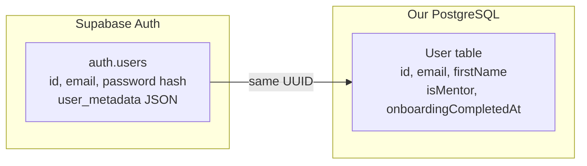
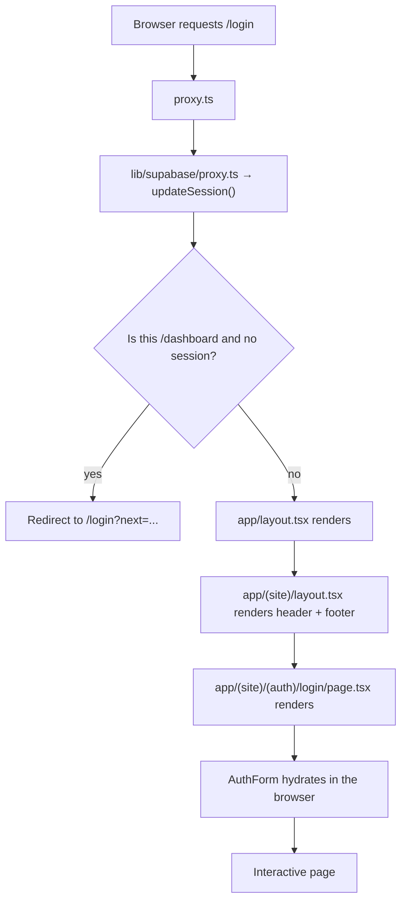
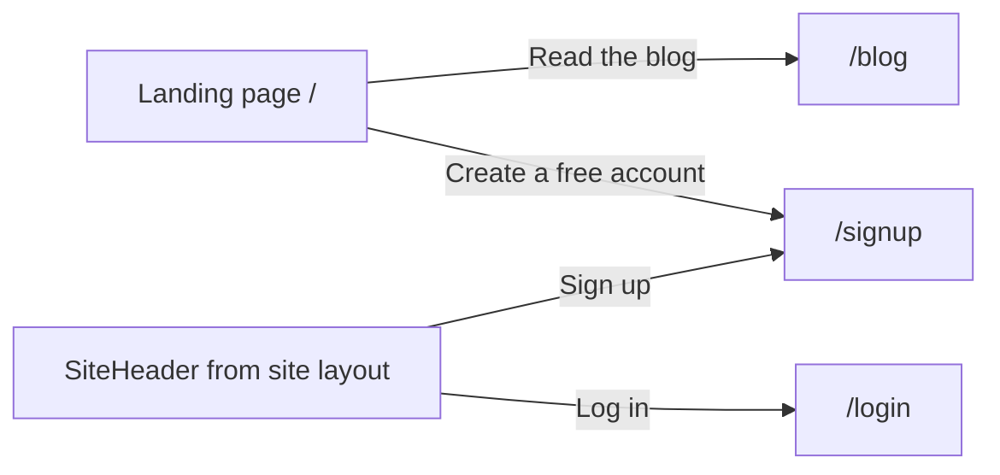
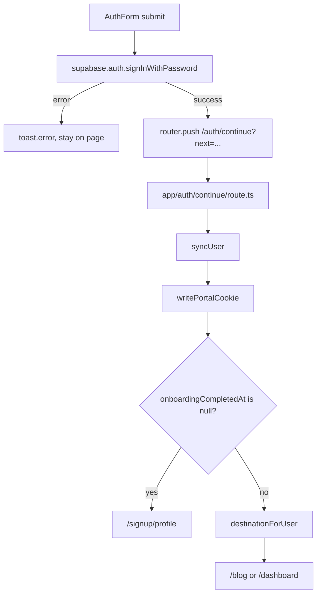
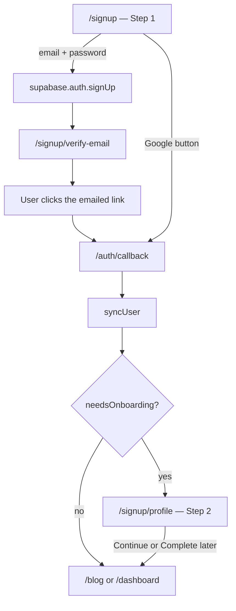
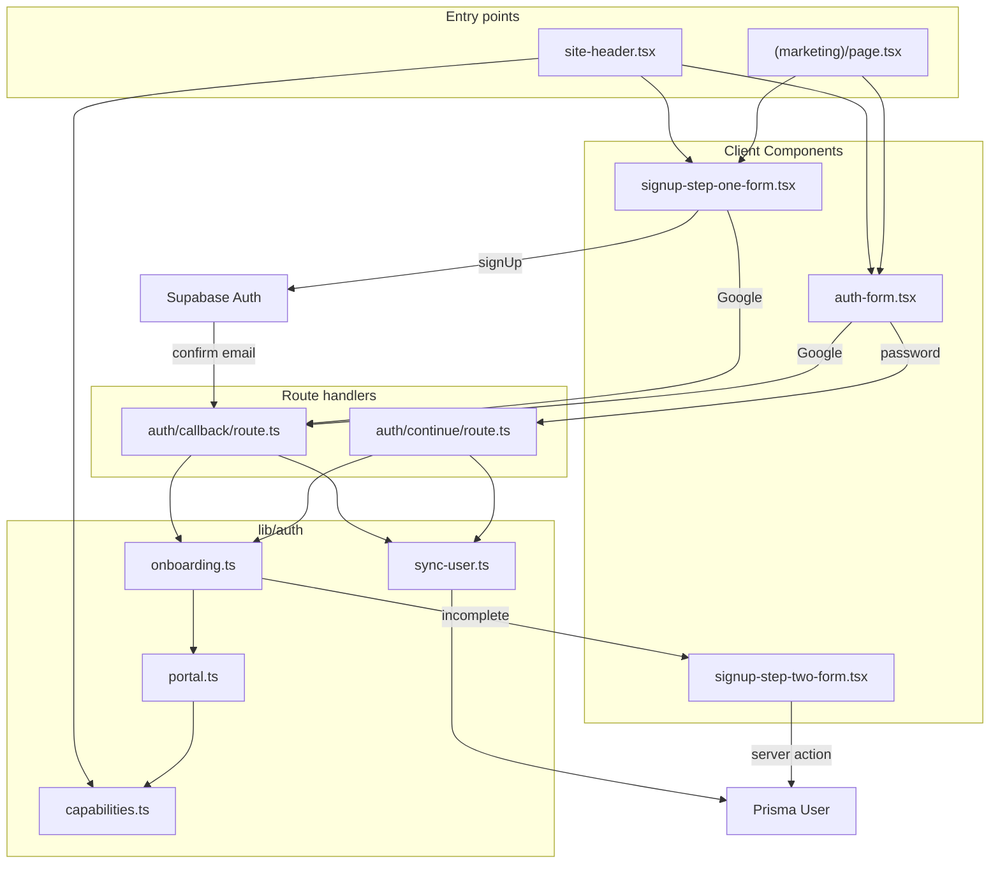

# HobbyEngineerDeck — Codebase Guide, Part 1

**Scope of Part 1:** the technology stack, the project structure (every folder and why it exists), the landing page, and the complete signup and login flows.

**Who this is written for:** a developer who knows how enterprise applications work but has never used React, Next.js, Supabase, or Prisma. Nothing is assumed. Where a concept has a rough Pega equivalent, there is a callout — but the analogies are approximations, not exact mappings.

---

## Table of contents

1. [What the application does](#1-what-the-application-does)
2. [The technology stack, explained from zero](#2-the-technology-stack-explained-from-zero)
3. [The two identity systems (the most important concept)](#3-the-two-identity-systems)
4. [Project structure](#4-project-structure)
5. [Root configuration files](#5-root-configuration-files)
6. [How a page request actually flows](#6-how-a-page-request-actually-flows)
7. [Layouts and route groups](#7-layouts-and-route-groups)
8. [The landing page](#8-the-landing-page)
9. [The auth building blocks](#9-the-auth-building-blocks)
10. [Login flow, end to end](#10-login-flow-end-to-end)
11. [Signup flow, end to end](#11-signup-flow-end-to-end)
12. [The User data model](#12-the-user-data-model)
13. [File-to-file connection map](#13-file-to-file-connection-map)
14. [Pega translation table](#14-pega-translation-table)
15. [Glossary](#15-glossary)
16. [Running it locally](#16-running-it-locally)

---

## 1. What the application does

HobbyEngineerDeck is a website for hobbyist engineers. Today it has four working pieces:

| Piece | URL | Status |
|---|---|---|
| Marketing landing page | `/` | Live |
| Public blog | `/blog` | Live (Part 2) |
| Accounts — signup, login, profile | `/signup`, `/login` | Live (this document) |
| Mentor dashboard and blog editor | `/dashboard` | Live (Part 2) |

There are three kinds of people:

- **Visitor** — not logged in. Can read the landing page and published blog posts.
- **Member** — logged in. Same reading access, plus a profile. This is what everyone gets by default at signup.
- **Mentor / Admin** — can write and publish blog posts. This is granted manually by flipping a database flag; there is no UI to promote someone.

---

## 2. The technology stack, explained from zero

Six technologies matter for Part 1. Here is what each one is and why it is here.

### 2.1 TypeScript

**What it is:** JavaScript with type declarations added. The browser and server ultimately run plain JavaScript; TypeScript is a layer that catches mistakes before the code runs.

```ts
// The ": string" and ": boolean" are TypeScript. They are erased before running.
function greet(name: string, loud: boolean) {
  return loud ? `HELLO ${name.toUpperCase()}` : `Hello ${name}`;
}
```

**Why it is here:** the project talks to a database and an auth service. Types mean the compiler tells you "this user object has no `role` field" instead of the site crashing at runtime.

**File extensions you will see:**

| Extension | Meaning |
|---|---|
| `.ts` | TypeScript, no UI markup inside |
| `.tsx` | TypeScript that contains JSX (UI markup) |

> **Pega note:** conceptually similar to property definitions on a Data class — the shape is declared once and validated everywhere it is used.

### 2.2 React

**What it is:** a library for building user interfaces out of **components**. A component is a function that returns markup.

```tsx
// A component is just a function whose name starts with a capital letter.
function SiteFooter() {
  return <footer>HobbyEngineerDeck</footer>;
}
```

That `<footer>...</footer>` inside JavaScript is **JSX** — HTML-like syntax that gets compiled into real DOM elements.

Three React concepts appear constantly in this codebase:

**Props** — inputs passed into a component, like function arguments:

```tsx
function Greeting({ name }: { name: string }) {
  return <p>Hello {name}</p>;
}

// Used like an HTML attribute:
<Greeting name="Syam" />
```

**State** — a value the component remembers between renders. When state changes, React re-draws that component:

```tsx
const [pending, setPending] = useState(false);
// pending    → current value
// setPending → function to change it, which triggers a re-render
```

You will see this in every form in this project — it is how the buttons know to show a spinner.

**Hooks** — functions starting with `use` that plug into React's machinery. This project uses `useState` (remember a value), `useRouter` (navigate programmatically), `useSearchParams` (read `?next=/blog` from the URL), and `useTransition` (track a pending server call).

> **Pega note:** a component is roughly a Section rule. Props are like parameters passed into a Section. State is a small, component-local clipboard page that only that Section can see.

### 2.3 Next.js (the App Router)

**What it is:** the framework that turns this pile of React components into a real website with URLs, server rendering, and API endpoints.

The critical idea: **folders inside `app/` become URLs.** There is no route configuration file anywhere.

| File on disk | URL it serves |
|---|---|
| `app/(site)/(marketing)/page.tsx` | `/` |
| `app/(site)/(auth)/login/page.tsx` | `/login` |
| `app/(site)/(auth)/signup/page.tsx` | `/signup` |
| `app/(site)/(auth)/signup/profile/page.tsx` | `/signup/profile` |
| `app/auth/callback/route.ts` | `/auth/callback` |

Four special filenames control everything:

| Filename | Purpose |
|---|---|
| `page.tsx` | The page shown at this URL |
| `layout.tsx` | A wrapper around this folder and everything below it |
| `loading.tsx` | Placeholder UI shown while the page is being prepared on the server |
| `route.ts` | A raw HTTP endpoint (returns a redirect or JSON, not a page) |

#### Route groups — folders in parentheses

A folder named `(site)` or `(auth)` **does not appear in the URL**. It exists purely to group files and to attach a shared layout to them.

```
app/(site)/(auth)/login/page.tsx   →   /login
             ^^^^^^  ^^^^^^
             these two are invisible in the URL
```

This is why the URL is `/login` and not `/site/auth/login`.

#### Server Components vs Client Components — the single most important Next.js concept

By default, **every component in this project runs on the server**. It executes once, on the server, produces HTML, and ships that HTML to the browser. The component's code itself never reaches the user.

A Server Component **can** query the database directly and read secrets. It **cannot** use `useState`, respond to clicks, or use browser APIs.

To make a component run in the browser instead, you put `"use client";` as the very first line of the file.

```tsx
"use client";           // ← this line changes everything below it

import { useState } from "react";

export function SignOutButton() {
  const [loading, setLoading] = useState(false);   // only legal in a Client Component
  // ...
}
```

| | Server Component (default) | Client Component (`"use client"`) |
|---|---|---|
| Runs where | On the server, before the response is sent | In the user's browser |
| Can query the database | Yes | No |
| Can read secret env vars | Yes | No |
| Can use `useState` / `onClick` | No | Yes |
| Code visible to the user | No | Yes |
| Examples here | [`site-header.tsx`](../components/site/site-header.tsx), all `page.tsx` files | [`auth-form.tsx`](../components/auth/auth-form.tsx), [`sign-out-button.tsx`](../components/site/sign-out-button.tsx) |

**Rule of thumb used throughout this codebase:** pages are Server Components that fetch data; interactive forms are Client Components marked `"use client"`.

#### Server Actions

A Server Action is a function that lives on the server but can be called directly from a Client Component, as if it were a local function. The file starts with `"use server";`.

```ts
"use server";                       // every export here runs on the server

export async function skipOnboarding(formData: FormData) {
  const appUser = await requireAppUser();
  await prisma.user.update({ /* ... */ });
  redirect("/blog");
}
```

Next.js turns the call into an HTTP request automatically. There is no API route to write, no fetch call, no JSON parsing. Used in [`lib/auth/onboarding-actions.ts`](../lib/auth/onboarding-actions.ts).

> **Pega note:** a Server Action is close to calling an Activity from a UI control. The difference is that the "activity" is a normal TypeScript function and the wiring is generated for you.

### 2.4 Tailwind CSS

**What it is:** a CSS approach where you compose styles from small single-purpose class names directly in the markup, instead of writing separate `.css` files.

```tsx
<div className="mx-auto w-full max-w-sm space-y-6">
```

Reads as: horizontal margin auto (centered), full width, capped at "small" width, and 1.5rem of vertical space between children.

Common patterns in this repo:

| Class | Meaning |
|---|---|
| `flex`, `grid` | Layout mode |
| `gap-2`, `space-y-4` | Spacing between children |
| `px-4`, `py-16`, `mt-2` | Padding / margin (x = horizontal, y = vertical, t = top) |
| `text-sm`, `font-medium` | Typography |
| `sm:`, `lg:` prefix | Only applies at that screen size or wider |
| `text-muted-foreground` | A **design token**, defined in [`app/globals.css`](../app/globals.css) |

The brand accent colour is `#fcbf30` (the yellow on buttons and the loading bar).

There is one helper you will see everywhere, `cn()` from [`lib/utils.ts`](../lib/utils.ts):

```ts
export function cn(...inputs: ClassValue[]) {
  return twMerge(clsx(inputs));
}
```

It merges class lists and resolves conflicts intelligently — if two classes both set padding, the last one wins instead of both being emitted.

### 2.5 Supabase

**What it is:** a hosted backend service. This project uses two parts of it:

- **Supabase Auth** — stores email/password credentials, handles Google sign-in, sends confirmation emails, and issues session cookies.
- **Supabase Storage** — holds uploaded blog cover images (Part 2).

Supabase keeps its own user table, `auth.users`, which this application does **not** write to directly. It only calls the Auth API.

There are two client factories because server and browser need different cookie handling:

| File | Used from | What it does |
|---|---|---|
| [`lib/supabase/client.ts`](../lib/supabase/client.ts) | Client Components | Browser client; reads cookies from `document.cookie` |
| [`lib/supabase/server.ts`](../lib/supabase/server.ts) | Server Components, route handlers | Server client; reads cookies via Next.js `cookies()` |

### 2.6 Prisma + PostgreSQL

**What it is:** PostgreSQL is the database. Prisma is the ORM — you describe your tables in one schema file, and Prisma generates a fully typed client for querying them.

The schema lives at [`prisma/schema.prisma`](../prisma/schema.prisma):

```prisma
model User {
  id                    String     @id @db.Uuid
  email                 String     @unique
  firstName             String?
  isMentor              Boolean    @default(false)
  onboardingCompletedAt DateTime?
  blogPosts             BlogPost[]
}
```

Running `npx prisma generate` reads that file and writes a typed client into `lib/generated/prisma/`. You then query like this:

```ts
const user = await prisma.user.findUnique({ where: { id: authUser.id } });
```

If you ask for `user.role`, TypeScript fails the build, because that column does not exist.

**Migrations** live in `prisma/migrations/`. Each is a timestamped folder with a `migration.sql` file — the raw SQL that moves the database from one schema version to the next. They run in filename order and are never edited after being applied.

> **Pega note:** `schema.prisma` plays the role of your Data class definitions; the migrations folder plays the role of DDL scripts shipped with a release.

---

## 3. The two identity systems

This trips up everyone reading the auth code for the first time. **There are two separate user records for every person.**



| | Supabase `auth.users` | Our Prisma `User` |
|---|---|---|
| Owns | Credentials, sessions, email confirmation | Profile, permissions, onboarding state |
| Written by | Supabase, when you call `signUp` / OAuth | Our code, via `syncUser()` |
| Contains | `id`, `email`, `user_metadata` (free-form JSON) | `firstName`, `isMentor`, `memberType`, `onboardingCompletedAt`, … |
| Queried by | `supabase.auth.getUser()` | `prisma.user.findUnique(...)` |

**They are linked by sharing the same UUID.** Supabase generates the `id`; we reuse it as the primary key of our `User` row.

The bridge between them is one function — [`syncUser()`](../lib/auth/sync-user.ts). It takes a Supabase auth user and guarantees a matching Prisma row exists:

```ts
export async function syncUser(authUser: AuthUser) {
  const byId = await prisma.user.findUnique({ where: { id: authUser.id } });
  if (byId) {
    return prisma.user.update({ /* refresh name, avatar, phone */ });
  }
  // ...otherwise create the row, defaulting isMember true, isMentor false
}
```

`syncUser()` is called on **every** authenticated request path. That is deliberate: it means a user who signs in via Google for the first time automatically gets a profile row without any special-case code.

**Why two systems at all?** Because Supabase owns password hashing and session security (things you should never hand-roll), while the application owns everything specific to this product — who is a mentor, what someone is interested in, whether they finished onboarding.

---

## 4. Project structure

```
HobbyEngineerDeck/
│
├── app/                        ← ROUTES. Folder names become URLs.
│   ├── layout.tsx              Root wrapper: <html>, fonts, toasts, loading bar
│   ├── globals.css             Design tokens + Tailwind theme
│   ├── favicon.ico
│   │
│   ├── (site)/                 Route group: the public-facing site
│   │   ├── layout.tsx          Adds SiteHeader + SiteFooter around every child
│   │   ├── loading.tsx         Skeleton shown while any site page loads
│   │   │
│   │   ├── (marketing)/
│   │   │   └── page.tsx        → /            the landing page
│   │   │
│   │   ├── (auth)/             Route group: everything account-related
│   │   │   ├── login/
│   │   │   │   └── page.tsx    → /login
│   │   │   └── signup/
│   │   │       ├── page.tsx            → /signup                 Step 1
│   │   │       ├── verify-email/
│   │   │       │   └── page.tsx        → /signup/verify-email    "check your inbox"
│   │   │       └── profile/
│   │   │           └── page.tsx        → /signup/profile         Step 2
│   │   │
│   │   └── blog/               → /blog and /blog/[slug]          (Part 2)
│   │
│   ├── (mentor)/
│   │   └── dashboard/          → /dashboard                      (Part 2)
│   │
│   └── auth/                   HTTP endpoints, not pages
│       ├── callback/route.ts   → /auth/callback    OAuth + email-confirm landing
│       └── continue/route.ts   → /auth/continue    post-password-login landing
│
├── components/                 ← REUSABLE UI. Never becomes a URL.
│   ├── auth/                   Login and signup forms
│   ├── site/                   Header, footer, sign-out, portal switcher
│   ├── mentor/                 Dashboard chrome                  (Part 2)
│   ├── blog/                   Post cards, editor                (Part 2)
│   └── ui/                     Generic primitives: Button, Input, Select, …
│
├── lib/                        ← LOGIC. No UI. Mostly server-side.
│   ├── auth/                   Session, sync, permissions, onboarding, portal
│   ├── supabase/               Supabase client factories + request proxy helper
│   ├── prisma/                 Database client singleton
│   ├── blog/                   Blog helpers                      (Part 2)
│   ├── generated/prisma/       AUTO-GENERATED. Never edit by hand.
│   └── utils.ts                cn() class-name merger
│
├── prisma/
│   ├── schema.prisma           Table definitions
│   └── migrations/             Timestamped SQL, applied in order
│
├── public/                     Static files served as-is at the site root
├── scripts/                    One-off maintenance scripts
├── supabase/                   Supabase project config
│
├── proxy.ts                    ← Runs before EVERY request
├── next.config.ts              Next.js configuration
├── tsconfig.json               TypeScript configuration
├── components.json             shadcn/ui generator settings
├── package.json                Dependencies and npm scripts
├── .env.example                Template for required secrets
└── docs/part-1.md              ← You are here
```

### Why the code is split this way

The split is by **responsibility**, and the rule is one-directional: `app/` imports from `components/` and `lib/`; `components/` imports from `lib/`; `lib/` imports from nothing above it.

| Folder | Contains | Why it is separate |
|---|---|---|
| `app/` | Pages, layouts, HTTP endpoints | Next.js requires this exact structure for routing. Keeping only routing concerns here means a page file stays short and readable. |
| `components/` | Presentational React components | The same header appears on ten pages. If it lived inside a page file, it could not be shared. |
| `components/ui/` | Button, Input, Label, Select, Dialog, … | Generated by shadcn/ui. These are copied into the repo (not installed as a package) so they can be edited freely — for example, `Button` was extended with a `loading` prop. |
| `lib/` | Business logic and integrations | Logic here is testable and reusable from both a page and a route handler. `syncUser()` is called from three places; it belongs in exactly one file. |
| `lib/generated/` | Prisma's generated client | Machine output. Regenerated by `npx prisma generate`. Editing it is pointless — changes are overwritten. |
| `prisma/` | Schema and migrations | Single source of truth for database shape. |
| `public/` | Images, fonts, static assets | Served directly at `/filename` with no processing. |

### The `@/` import shortcut

You will see imports like this everywhere:

```ts
import { Button } from "@/components/ui/button";
import { prisma } from "@/lib/prisma/client";
```

`@/` means "the project root." It is configured in [`tsconfig.json`](../tsconfig.json):

```json
"paths": { "@/*": ["./*"] }
```

Without it, a deeply nested file would need `../../../components/ui/button`.

---

## 5. Root configuration files

| File | What it controls |
|---|---|
| [`package.json`](../package.json) | Dependency list and the npm scripts: `dev` (start dev server), `build`, `start`, `lint`, `db:migrate`, `db:generate`. Note `postinstall` runs `prisma generate` automatically after `npm install`. |
| [`tsconfig.json`](../tsconfig.json) | TypeScript settings. `strict: true` means null-safety is enforced. `paths` defines the `@/` alias. |
| [`next.config.ts`](../next.config.ts) | Next.js settings. Currently only whitelists `*.supabase.co` as an allowed image host, so `next/image` will render blog covers from Supabase Storage. |
| [`proxy.ts`](../proxy.ts) | Runs before every matched request. Explained in the next section. |
| [`components.json`](../components.json) | Tells the shadcn/ui CLI where to place generated components and which style variant to use. |
| [`.env.example`](../.env.example) | Template listing required environment variables. Copy to `.env.local` and fill in. |
| [`app/globals.css`](../app/globals.css) | Tailwind import plus the CSS custom properties behind tokens like `bg-background` and `text-muted-foreground`. |

### Environment variables

```
NEXT_PUBLIC_SUPABASE_URL=
NEXT_PUBLIC_SUPABASE_PUBLISHABLE_KEY=
SUPABASE_SECRET_KEY=
DATABASE_URL=
DIRECT_URL=
NEXT_PUBLIC_SITE_URL=http://localhost:3000
```

The `NEXT_PUBLIC_` prefix is a security boundary, not a naming convention. Variables with that prefix are **embedded into the JavaScript bundle and visible to anyone**. Variables without it exist only on the server.

That is why the browser Supabase client uses the *publishable* key, while `SUPABASE_SECRET_KEY` and `DATABASE_URL` have no prefix — those must never leave the server.

---

## 6. How a page request actually flows

When someone types `localhost:3000/login`, this happens in order:



### Step 1 — `proxy.ts`

[`proxy.ts`](../proxy.ts) is Next.js's request interceptor. (In older Next.js versions this file was called `middleware.ts`; this version renamed it.)

```ts
export async function proxy(request: NextRequest) {
  return updateSession(request);
}

export const config = {
  matcher: ["/((?!_next/static|_next/image|favicon.ico|.*\\.(?:svg|png|jpg|jpeg|gif|webp)$).*)"],
};
```

The `matcher` regex means "run on every request except static assets and images."

It delegates to [`lib/supabase/proxy.ts`](../lib/supabase/proxy.ts), which does three jobs:

1. **Refresh the Supabase session.** Auth tokens expire. Reading the user here silently renews the cookie so users are not logged out mid-session.
2. **Guard the dashboard.** If the path starts with `/dashboard` and there is no session, redirect to `/login?next=<the path they wanted>`.
3. **Set the portal cookie.** Derive `learner` or `mentor` from the URL and write the `hed_portal` cookie.

```ts
if (!user && request.nextUrl.pathname.startsWith("/dashboard")) {
  const redirectUrl = request.nextUrl.clone();
  redirectUrl.pathname = "/login";
  redirectUrl.searchParams.set("next", request.nextUrl.pathname);
  return NextResponse.redirect(redirectUrl);
}
```

Note what is **not** guarded: `/login`, `/signup`, `/`, and `/blog` are open to everyone. `/signup/profile` is guarded inside the page itself, not here.

> **Pega note:** `proxy.ts` is the closest thing this app has to an authentication servlet filter — one place that every request passes through before any page logic runs.

### Step 2 onwards — layouts nest, then the page renders

Next.js walks down the folder tree and wraps each layout around the next. All of this runs on the server; the browser receives finished HTML.

---

## 7. Layouts and route groups

A `layout.tsx` wraps its folder and everything nested beneath it. It receives the page as a prop called `children`.

For `/login`, two layouts apply:

```
app/layout.tsx                       ← outermost
  └── app/(site)/layout.tsx
        └── app/(site)/(auth)/login/page.tsx
```

### The root layout

[`app/layout.tsx`](../app/layout.tsx) is the only place `<html>` and `<body>` exist:

```tsx
export default function RootLayout({ children }: { children: ReactNode }) {
  return (
    <html lang="en" className={`${geistSans.variable} ... h-full antialiased`}>
      <body className="flex min-h-full flex-col">
        <NextTopLoader color="#fcbf30" height={3} showSpinner={false} />
        {children}
        <Toaster />
      </body>
    </html>
  );
}
```

What it sets up globally:

| Element | Purpose |
|---|---|
| Google fonts (Geist, Geist Mono, Source Serif) | Loaded as CSS variables so Tailwind classes like `font-heading` can use them |
| `NextTopLoader` | The thin yellow progress bar that animates during navigation |
| `{children}` | Wherever the actual page gets injected |
| `Toaster` | Mount point for pop-up notifications (`toast.error(...)` from anywhere) |
| `metadata` export | Default `<title>` and description; child pages can override |

Note there is **no navigation here**. That is intentional — the dashboard has different chrome from the public site.

### The site layout

[`app/(site)/layout.tsx`](../app/(site)/layout.tsx) adds the public site chrome:

```tsx
export default function SiteLayout({ children }: { children: ReactNode }) {
  return (
    <>
      <SiteHeader />
      <div className="flex flex-1 flex-col">{children}</div>
      <SiteFooter />
    </>
  );
}
```

Because the landing page, login, signup, and blog all sit under `(site)/`, they all get the same header and footer without importing anything.

### The header adapts to who you are

[`components/site/site-header.tsx`](../components/site/site-header.tsx) is a **Server Component** — it reads the session on the server before sending HTML, so there is no flash of the wrong navigation.

```tsx
export async function SiteHeader() {
  let authUser = null;
  try {
    authUser = await getAuthUser();
  } catch {
    authUser = null;
  }

  let appUser = null;
  if (authUser) {
    const session = await getSessionContext();
    appUser = session.appUser;
  }
  const mentor = appUser ? canAuthor(appUser) : false;
  const navLinks = authUser ? memberLinks : publicLinks;
  // ...
}
```

The resulting header:

| Visitor state | Right-hand side of the header |
|---|---|
| Not logged in | "Log in" link + yellow "Sign up" button |
| Logged in, member | "Sign out" |
| Logged in, mentor/admin | Portal switcher (Learner ⇄ Mentor) + "Sign out" |

The `try/catch` blocks matter: if the database is unreachable, the header degrades to the logged-out view instead of crashing the whole page.

### `loading.tsx`

[`app/(site)/loading.tsx`](../app/(site)/loading.tsx) is shown automatically while a server page in that segment is still being prepared. The header and footer stay visible; only the page body is replaced with a pulsing skeleton. You never write code to trigger it — Next.js does it based on the filename.

---

## 8. The landing page

**File:** [`app/(site)/(marketing)/page.tsx`](../app/(site)/(marketing)/page.tsx)

This is the largest single file in Part 1's scope, and deliberately self-contained. There is no `components/marketing/` folder — hero, feature grid, about, CTA, and FAQ all live in this one file, because none of it is reused anywhere else.

It is a **Server Component with no data fetching**. It touches neither Supabase nor Prisma. The output is effectively static HTML.

### How the file is organised

```tsx
// 1. Imports — Link, a set of lucide-react icons, buttonVariants, cn
import Link from "next/link";
import { BookOpen, Briefcase, /* ...many icons... */ } from "lucide-react";

// 2. Module-level content data, defined outside the component
const topics = ["Embedded", "RF", "Mechanical", "Firmware", "Shop notes"];

const modules = [
  { icon: Rocket,    title: "Publish a course",  body: "...", live: false },
  { icon: Newspaper, title: "Write a build log", body: "...", live: true  },
  // ...
];

const faqs = [
  { q: "Is HobbyEngineerDeck a paid course?", a: "No. ..." },
  // ...
];

// 3. A local helper component for the decorative code-editor graphic

// 4. The default export — the page itself
export default function MarketingPage() { /* sections */ }
```

Keeping content in arrays and rendering with `.map()` means adding an FAQ entry is a one-line data change, not a markup change:

```tsx
{faqs.map((item) => (
  <div key={item.q}>
    <h3>{item.q}</h3>
    <p>{item.a}</p>
  </div>
))}
```

The `key` prop is required by React whenever you render a list — it uses it to track which item is which across re-renders.

### Sections, in order

| Section | Anchor | Content |
|---|---|---|
| Hero | — | Headline, subcopy, "Create a free account" CTA, "Read the blog" link, and the decorative code-editor graphic |
| Topic strip | — | Horizontal band of topic chips |
| What's inside | `#whats-inside` | Grid of the six `modules`, each flagged live or coming-soon |
| About | `#about` | "Built by people who still debug at midnight" |
| Join the bench | — | Second conversion block |
| FAQ | `#faq` | The `faqs` array rendered as a list |

### How it links into the rest of the app



Navigation uses `next/link`, not `<a>`:

```tsx
<Link href="/signup" className={cn(buttonVariants(), "pill-cta")}>
  Create a free account
</Link>
```

`Link` performs a client-side navigation — Next.js fetches only the new page's data and swaps the content, instead of a full browser reload. It also prefetches the target in the background when the link scrolls into view, which is why navigation feels instant.

The `cn(buttonVariants(), "pill-cta")` pattern is worth understanding: `buttonVariants()` returns the Button component's class string, so a `Link` can be styled to look exactly like a button while remaining a real anchor tag (correct for accessibility and right-click "open in new tab").

---

## 9. The auth building blocks

Before tracing the flows, here is what each auth file is responsible for. Everything in `lib/auth/` is server-side except `password.ts`.

| File | Exports | Responsibility |
|---|---|---|
| [`lib/supabase/client.ts`](../lib/supabase/client.ts) | `createClient()` | Browser Supabase client. Used by forms to call `signUp` / `signInWithPassword` / OAuth. |
| [`lib/supabase/server.ts`](../lib/supabase/server.ts) | `createClient()` | Server Supabase client, cookie-aware. Used by pages and route handlers. |
| [`lib/supabase/proxy.ts`](../lib/supabase/proxy.ts) | `updateSession()` | Called from `proxy.ts`. Refreshes session, guards `/dashboard`, sets portal cookie. |
| [`lib/auth/session.ts`](../lib/auth/session.ts) | `getAuthUser`, `getAppUser`, `requireAppUser`, `requireAuthor`, `getSessionContext` | The entry point pages use to ask "who is this?" |
| [`lib/auth/sync-user.ts`](../lib/auth/sync-user.ts) | `syncUser()` | Creates or updates the Prisma `User` from the Supabase auth user. |
| [`lib/auth/capabilities.ts`](../lib/auth/capabilities.ts) | `canAuthor`, `isMember`, `isAdmin` | Permission checks derived from the boolean flags. |
| [`lib/auth/onboarding.ts`](../lib/auth/onboarding.ts) | `needsOnboarding`, `onboardingDestination`, `resolvePostAuthDestination`, form option lists | Decides whether Step 2 is still owed. |
| [`lib/auth/onboarding-actions.ts`](../lib/auth/onboarding-actions.ts) | `saveOnboardingProfile`, `skipOnboarding` | Server Actions that write Step 2 answers. |
| [`lib/auth/portal.ts`](../lib/auth/portal.ts) | `homeForUser`, `destinationForUser`, `isSafeNextPath`, `getActivePortal` | Decides where a user lands after auth. |
| [`lib/auth/portal-cookie.ts`](../lib/auth/portal-cookie.ts) | `PORTAL_COOKIE`, `applyPortalCookie`, `portalForPath` | The `hed_portal` cookie. |
| [`lib/auth/password.ts`](../lib/auth/password.ts) | `PASSWORD_REQUIREMENTS`, `isPasswordValid`, `passwordsMatch` | Password rules, shared by the checklist UI and submit validation. |

### Permissions are boolean flags, not a role

[`lib/auth/capabilities.ts`](../lib/auth/capabilities.ts) is the entire permission model:

```ts
export function canAuthor(user: UserCapabilities) {
  return user.isMentor || user.isAdmin;
}

export function isMember(user: Pick<User, "isMember">) {
  return user.isMember;
}

export function isAdmin(user: Pick<User, "isAdmin">) {
  return user.isAdmin;
}
```

There used to be a single `role` enum column. It was removed because it could not express "an admin who is also a member." Three independent booleans can. Nothing reads a role anywhere in the codebase now.

To make someone a mentor, you flip `isMentor` to `true` in the database by hand. There is no admin UI for it yet.

### Where a user lands after auth

[`lib/auth/portal.ts`](../lib/auth/portal.ts):

```ts
export function homeForUser(user: UserCapabilities) {
  return canAuthor(user) ? "/dashboard" : "/blog";
}

export function isSafeNextPath(path: string, user: UserCapabilities) {
  if (!path.startsWith("/") || path.startsWith("//") || path.includes("\\")) {
    return false;
  }
  if (canAuthor(user)) {
    return path === "/dashboard" || path.startsWith("/dashboard/");
  }
  return path === "/blog" || path.startsWith("/blog/");
}

export function destinationForUser(user: UserCapabilities, next?: string | null) {
  if (next && isSafeNextPath(next, user)) {
    return next;
  }
  return homeForUser(user);
}
```

`isSafeNextPath` is a security control, not a convenience. Without it, an attacker could send someone a link to `/login?next=https://evil.example.com` and the app would redirect them there after login — an **open redirect**. The function rejects anything that is not a relative path, and additionally restricts the destination to areas the user is actually allowed into.

### The portal cookie

[`lib/auth/portal-cookie.ts`](../lib/auth/portal-cookie.ts) defines a cookie named `hed_portal` holding `"learner"` or `"mentor"`. It controls which chrome a mentor sees, since mentors can browse both the public site and the dashboard.

```ts
export function portalForPath(pathname: string): Portal | null {
  if (pathname.startsWith("/auth/")) return null;
  if (pathname === "/dashboard" || pathname.startsWith("/dashboard/")) return "mentor";
  if (
    pathname === "/" || pathname === "/blog" || pathname.startsWith("/blog/") ||
    pathname === "/login" || pathname === "/signup" || pathname.startsWith("/signup/")
  ) {
    return "learner";
  }
  return null;
}
```

The proxy calls this on every request, so simply navigating to `/dashboard` puts you in mentor chrome and navigating to `/blog` puts you back in learner chrome. `/auth/*` returns `null` deliberately — those route handlers set the cookie themselves based on the user, and the proxy must not overwrite that decision mid-flight.

### Reading the session from a page

[`lib/auth/session.ts`](../lib/auth/session.ts) gives pages five entry points:

```ts
export async function getAuthUser() {
  const supabase = await createClient();
  const { data: { user } } = await supabase.auth.getUser();
  return user;                       // Supabase user, or null
}

export async function requireAppUser() {
  const user = await getAuthUser();
  if (!user) redirect("/login");     // hard stop
  return syncUser(user);             // returns the Prisma User
}

export async function getAppUser() {
  try {
    const user = await getAuthUser();
    if (!user) return null;
    return await syncUser(user);     // returns Prisma User, or null
  } catch {
    return null;
  }
}

export async function requireAuthor() {
  const appUser = await requireAppUser();
  if (!canAuthor(appUser)) return { appUser, allowed: false as const };
  return { appUser, allowed: true as const };
}
```

Which one to use:

| Function | Use when |
|---|---|
| `getAuthUser()` | You only need to know *whether* someone is logged in |
| `getAppUser()` | Optional profile — page still renders for guests |
| `requireAppUser()` | Page requires login; redirect otherwise |
| `requireAuthor()` | Page requires mentor/admin; returns a flag so the page can show a friendly message instead of redirecting |
| `getSessionContext()` | You need both the user and their active portal |

Note that `requireAppUser` and `getAppUser` both call `syncUser`. Every authenticated page view keeps the Prisma row current.

---

## 10. Login flow, end to end

**Page:** [`app/(site)/(auth)/login/page.tsx`](../app/(site)/(auth)/login/page.tsx)
**Form:** [`components/auth/auth-form.tsx`](../components/auth/auth-form.tsx)

The page itself is four lines of substance:

```tsx
export default function LoginPage() {
  return (
    <main className="flex flex-1 items-center px-4 py-16">
      <Suspense>
        <AuthForm />
      </Suspense>
    </main>
  );
}
```

`<Suspense>` is required because `AuthForm` calls `useSearchParams()`. Reading the query string forces that subtree to render in the browser, and Suspense marks the boundary where Next.js is allowed to do that.

`AuthForm` handles **login only**. Signup used to share this component via a `mode` prop; that was removed when signup became a two-step flow.

### Path A — email and password



The form's submit handler:

```tsx
async function onSubmit(formData: FormData) {
  setPending(true);
  const email = String(formData.get("email") ?? "");
  const password = String(formData.get("password") ?? "");
  const supabase = createClient();

  const { error } = await supabase.auth.signInWithPassword({ email, password });

  if (error) {
    setPending(false);
    toast.error(error.message);
    return;
  }

  const continueUrl = next ? `/auth/continue?next=${encodeURIComponent(next)}` : "/auth/continue";
  router.push(continueUrl);
  router.refresh();
}
```

Three details worth noting:

- `setPending(true)` drives the button's spinner via `<Button loading={pending}>`. On success it is deliberately **never** reset — the spinner should keep running through the redirect rather than flicker back to idle.
- On error the message comes straight from Supabase, so "Invalid login credentials" is Supabase's wording, not ours.
- `router.refresh()` tells Next.js to re-fetch Server Components, so the header immediately reflects the new session.

**Why redirect to `/auth/continue` instead of straight to `/blog`?** Because at this moment the browser has a session cookie but the server has done nothing. Something has to run `syncUser`, set the portal cookie, and decide the destination. That work must happen server-side, so the client hands control to a route handler.

[`app/auth/continue/route.ts`](../app/auth/continue/route.ts) in full:

```ts
export async function GET(request: Request) {
  const { searchParams } = new URL(request.url);
  const next = searchParams.get("next");

  const authUser = await getAuthUser();
  if (!authUser) {
    redirect("/login");
  }

  const appUser = await syncUser(authUser);
  await writePortalCookie(portalForUser(appUser));
  redirect(resolvePostAuthDestination(appUser, next));
}
```

`route.ts` exports HTTP methods by name. `GET` here means a plain browser navigation hits this function. It returns a redirect, never HTML.

### Path B — Google

```tsx
async function onGoogle() {
  setGooglePending(true);
  const supabase = createClient();
  const { error } = await supabase.auth.signInWithOAuth({
    provider: "google",
    options: {
      redirectTo: `${window.location.origin}/auth/callback?next=${encodeURIComponent(next)}`,
    },
  });
  if (error) {
    setGooglePending(false);
    toast.error(error.message);
  }
}
```

The browser leaves the site entirely: Google → Supabase → back to `/auth/callback` with a one-time `code` in the query string.

[`app/auth/callback/route.ts`](../app/auth/callback/route.ts) trades that code for a session:

```ts
export async function GET(request: Request) {
  const { searchParams, origin } = new URL(request.url);
  const code = searchParams.get("code");
  const next = searchParams.get("next");

  if (code) {
    const supabase = await createClient();
    const { data, error } = await supabase.auth.exchangeCodeForSession(code);
    if (!error && data.user) {
      const appUser = await syncUser(data.user);
      await writePortalCookie(portalForUser(appUser));
      const destination = resolvePostAuthDestination(appUser, next);
      const response = NextResponse.redirect(new URL(destination, origin));
      applyPortalCookie(response.cookies, portalForUser(appUser));
      return response;
    }
  }

  return NextResponse.redirect(new URL("/login?error=auth", origin));
}
```

The cookie is written twice on purpose — once through `writePortalCookie` (the Next.js cookie store) and once via `applyPortalCookie` on the outgoing response. During a redirect the response cookies are what actually reach the browser, so the second call is the one that sticks.

### The shared decision at the end of both paths

Both routes finish by calling the same function in [`lib/auth/onboarding.ts`](../lib/auth/onboarding.ts):

```ts
export function needsOnboarding(user: OnboardingUser) {
  return user.onboardingCompletedAt === null;
}

export function resolvePostAuthDestination(user, next?: string | null) {
  if (needsOnboarding(user)) {
    return onboardingDestination(next);   // → /signup/profile?next=...
  }
  return destinationForUser(user, next);  // → /blog or /dashboard
}
```

This single function is why an incomplete profile follows you: log in six months later without having finished Step 2, and you still land on `/signup/profile`. One `null` check, checked at every entry point.

---

## 11. Signup flow, end to end

Signup is deliberately split so account creation stays fast and profile questions are optional.



### Step 1 — account basics

**Page:** [`app/(site)/(auth)/signup/page.tsx`](../app/(site)/(auth)/signup/page.tsx)
**Form:** [`components/auth/signup-step-one-form.tsx`](../components/auth/signup-step-one-form.tsx)

Fields: first name, last name, email, optional phone, password, confirm password.

Each field is a piece of state:

```tsx
const [firstName, setFirstName] = useState("");
const [lastName, setLastName] = useState("");
const [email, setEmail] = useState("");
const [phoneCountryCode, setPhoneCountryCode] = useState<string>(PHONE_COUNTRY_CODES[0].value);
const [phoneNumber, setPhoneNumber] = useState("");
const [password, setPassword] = useState("");
const [confirmPassword, setConfirmPassword] = useState("");
```

This is the **controlled input** pattern: the input's value comes from state, and every keystroke writes back to state. It costs a few lines but makes live validation — the password checklist ticking green as you type — trivial.

#### Password rules

[`lib/auth/password.ts`](../lib/auth/password.ts) defines the rules once as data:

```ts
export const PASSWORD_REQUIREMENTS: PasswordRequirement[] = [
  { id: "length",    label: "At least 8 characters",  test: (p) => p.length >= 8 },
  { id: "uppercase", label: "One uppercase letter",   test: (p) => /[A-Z]/.test(p) },
  { id: "number",    label: "One number",             test: (p) => /[0-9]/.test(p) },
  { id: "special",   label: "One special character",  test: (p) => /[^A-Za-z0-9]/.test(p) },
];

export function isPasswordValid(password: string) {
  return PASSWORD_REQUIREMENTS.every((requirement) => requirement.test(password));
}
```

[`components/auth/password-field.tsx`](../components/auth/password-field.tsx) renders that same array as the live checklist, and the submit handler calls `isPasswordValid()`. One definition, two consumers — the displayed rules can never drift from the enforced rules.

That file exports two components: `PasswordField` (with the show/hide eye toggle and optional checklist) and `ConfirmPasswordField` (with live "Passwords match" / "Passwords do not match" feedback).

#### Submitting

```tsx
async function onSubmit(event: React.FormEvent) {
  event.preventDefault();

  if (!firstName.trim() || !lastName.trim()) {
    toast.error("First and last name are required");
    return;
  }
  if (!isPasswordValid(password)) {
    toast.error("Password does not meet all requirements");
    return;
  }
  if (!passwordsMatch(password, confirmPassword)) {
    toast.error("Passwords do not match");
    return;
  }

  setPending(true);
  const supabase = createClient();
  const trimmedPhone = phoneNumber.trim();
  const { error } = await supabase.auth.signUp({
    email: email.trim(),
    password,
    options: {
      data: {
        first_name: firstName.trim(),
        last_name: lastName.trim(),
        full_name: `${firstName.trim()} ${lastName.trim()}`,
        ...(trimmedPhone
          ? { phone_country_code: phoneCountryCode, phone_number: trimmedPhone }
          : {}),
      },
      emailRedirectTo: `${window.location.origin}/auth/callback?next=${encodeURIComponent(profileNext)}`,
    },
  });

  if (error) {
    setPending(false);
    toast.error(error.message);
    return;
  }

  const params = new URLSearchParams({ email: email.trim() });
  router.push(`/signup/verify-email?${params.toString()}`);
}
```

Two things to understand here:

**`options.data`** is written into Supabase's `user_metadata` — a free-form JSON blob on the auth user. It is the only way to carry the name and phone across the email-confirmation gap, because no Prisma row exists yet. Later, `syncUser()` reads these keys back out and copies them into real columns.

The `...(trimmedPhone ? {...} : {})` syntax is a conditional spread: include those two keys only if a phone number was entered, otherwise include nothing.

**`emailRedirectTo`** is the URL Supabase embeds in the confirmation email. It points at `/auth/callback` and carries `next=/signup/profile`, which is how the user reaches Step 2 after confirming.

On success the user goes to the verify-email screen. There is **no session yet** — the account exists but is unconfirmed.

#### Google from Step 1

The Google button skips email confirmation entirely (Google has already verified the address). It goes straight to `/auth/callback?next=/signup/profile`, so an OAuth user lands on Step 2 immediately.

### The verify-email screen

**File:** [`app/(site)/(auth)/signup/verify-email/page.tsx`](../app/(site)/(auth)/signup/verify-email/page.tsx)

A static Server Component. It reads `?email=` purely to display it back:

```tsx
export default async function VerifyEmailPage({ searchParams }: VerifyEmailPageProps) {
  const { email } = await searchParams;
  // ...renders "We sent a confirmation link to <email>"
}
```

`searchParams` is a Promise in this version of Next.js and must be awaited. This page has no session and does no work — it exists so the user is not left staring at a form wondering what happened.

### Step 2 — profile

**Page:** [`app/(site)/(auth)/signup/profile/page.tsx`](../app/(site)/(auth)/signup/profile/page.tsx)
**Form:** [`components/auth/signup-step-two-form.tsx`](../components/auth/signup-step-two-form.tsx)
**Actions:** [`lib/auth/onboarding-actions.ts`](../lib/auth/onboarding-actions.ts)

The page guards itself, because the proxy does not cover `/signup/*`:

```tsx
export default async function SignupProfilePage({ searchParams }: ProfilePageProps) {
  const appUser = await requireAppUser();          // no session → redirect to /login
  const { next } = await searchParams;

  if (!needsOnboarding(appUser)) {
    redirect(destinationForUser(appUser, next));   // already done → skip this page
  }

  return (
    <main className="flex flex-1 items-center px-4 py-16">
      <Suspense>
        <SignupStepTwoForm />
      </Suspense>
    </main>
  );
}
```

The second check prevents someone from re-answering the questionnaire by typing the URL.

Fields:

| Field | Required | Control |
|---|---|---|
| What best describes you? | Yes (to save) | Select |
| Field of study | No | Select — only rendered when the answer above is Student |
| Experience level | No | Select |
| Primary interest areas | No | Multi-select pill buttons |
| Location | No | Text input |

The conditional field is plain JavaScript, not framework magic:

```tsx
{memberType === "STUDENT" ? (
  <div className="space-y-2">
    <Label htmlFor="fieldOfStudy">Field of study (optional)</Label>
    <Select id="fieldOfStudy" name="fieldOfStudy" defaultValue="">
      {/* options */}
    </Select>
  </div>
) : null}
```

Because `memberType` is state, changing the dropdown re-renders the component and the block appears or disappears.

The interest pills are not real form inputs, so their values are injected into the `FormData` manually before submitting:

```tsx
const [selectedInterests, setSelectedInterests] = useState<string[]>([]);

function toggleInterest(slug: string) {
  setSelectedInterests((current) =>
    current.includes(slug) ? current.filter((item) => item !== slug) : [...current, slug],
  );
}

async function onSubmit(event: React.FormEvent<HTMLFormElement>) {
  event.preventDefault();
  if (!memberType) return;
  setPending(true);
  try {
    const formData = new FormData(event.currentTarget);
    selectedInterests.forEach((slug) => formData.set(`interest-${slug}`, "on"));
    await saveOnboardingProfile(formData);
  } catch (error) {
    setPending(false);
    toast.error(error instanceof Error ? error.message : "Could not save profile");
  }
}
```

`await saveOnboardingProfile(formData)` looks like a local call but is a Server Action — Next.js serialises the FormData, posts it, and runs the function on the server.

#### The server actions

```ts
"use server";

export async function saveOnboardingProfile(formData: FormData) {
  const appUser = await requireAppUser();
  const next = readNext(formData);
  const memberType = parseMemberType(String(formData.get("memberType") ?? ""));

  if (!memberType) {
    throw new Error("Please choose what best describes you");
  }

  const fieldOfStudy =
    memberType === "STUDENT" ? parseFieldOfStudy(String(formData.get("fieldOfStudy") ?? "")) : null;
  const experienceLevel = parseExperienceLevel(String(formData.get("experienceLevel") ?? ""));
  const interestAreas = parseInterestAreas(formData);
  const location = String(formData.get("location") ?? "").trim() || null;

  const updated = await prisma.user.update({
    where: { id: appUser.id },
    data: {
      memberType,
      fieldOfStudy,
      experienceLevel,
      interestAreas,
      location,
      name: displayNameFromParts(appUser.firstName, appUser.lastName) ?? appUser.name,
      onboardingCompletedAt: new Date(),
    },
  });

  redirect(destinationForUser(updated, next));
}

export async function skipOnboarding(formData: FormData) {
  const appUser = await requireAppUser();
  const next = readNext(formData);

  const updated = await prisma.user.update({
    where: { id: appUser.id },
    data: { onboardingCompletedAt: new Date() },
  });

  redirect(destinationForUser(updated, next));
}
```

Points that matter:

- **`requireAppUser()` runs again inside the action.** The page already checked, but a Server Action is a network endpoint — anyone could call it directly. Never trust that the page-level check happened.
- **Every value is re-parsed and validated server-side.** `parseMemberType` only accepts values from the known enum list, so a hand-crafted request cannot write arbitrary data.
- **`fieldOfStudy` is force-cleared to `null` for non-students.** Answer "Student", pick "Electronics", then switch to "Software Engineer" — the stale answer is dropped rather than saved.
- **Both actions set `onboardingCompletedAt`.** That is what "skip" means: nothing is recorded, but the user is never asked again.

The option lists that both the form and the parsers use live in [`lib/auth/onboarding.ts`](../lib/auth/onboarding.ts):

```ts
export const MEMBER_TYPE_OPTIONS: { value: MemberType; label: string }[] = [
  { value: "STUDENT", label: "Student" },
  { value: "SOFTWARE_AI_ENGINEER", label: "Software/AI Engineer" },
  // ...
];

export const MEMBER_TYPES = MEMBER_TYPE_OPTIONS.map((option) => option.value);
```

The UI renders `MEMBER_TYPE_OPTIONS`; the server validates against `MEMBER_TYPES`. Adding an option is a one-line change that updates both, and the `MemberType` type comes from the Prisma schema, so the compiler rejects a label for an enum value the database does not have.

### Shared signup chrome

[`components/auth/auth-shell.tsx`](../components/auth/auth-shell.tsx) provides the common wrapper — step label, heading, description, content slot, footer slot — plus `SignInLink` and `SignUpLink`:

```tsx
export function AuthShell({ step, title, description, children, footer }: AuthShellProps) {
  return (
    <div className="mx-auto w-full max-w-sm space-y-6">
      {step ? <p className="text-muted-foreground text-xs font-medium uppercase">{step}</p> : null}
      <div className="space-y-1">
        <h1 className="font-heading text-3xl tracking-tight">{title}</h1>
        <p className="text-muted-foreground text-sm">{description}</p>
      </div>
      <div className="space-y-4">{children}</div>
      {footer}
    </div>
  );
}
```

The login form does **not** use `AuthShell` — it keeps its own markup, because routing it through the shell changed the visual grouping of the form, the Google button, and the footer link.

---

## 12. The User data model

From [`prisma/schema.prisma`](../prisma/schema.prisma):

```prisma
model User {
  id                    String           @id @db.Uuid
  email                 String           @unique
  name                  String?
  firstName             String?
  lastName              String?
  avatarUrl             String?
  phoneCountryCode      String?
  phoneNumber           String?
  memberType            MemberType?
  fieldOfStudy          FieldOfStudy?
  experienceLevel       ExperienceLevel?
  interestAreas         String[]         @default([])
  location              String?
  onboardingCompletedAt DateTime?
  isMember              Boolean          @default(true)
  isMentor              Boolean          @default(false)
  isAdmin               Boolean          @default(false)
  createdAt             DateTime         @default(now())
  blogPosts             BlogPost[]
}
```

Reading the annotations: `?` means nullable, `@id` is the primary key, `@unique` adds a unique index, `@db.Uuid` sets the Postgres column type, `@default(...)` sets a default, and `BlogPost[]` is a relation rather than a column.

Where each field comes from:

| Field | Written by |
|---|---|
| `id`, `email` | `syncUser()` on first authenticated request |
| `firstName`, `lastName`, `name` | Step 1 metadata, copied by `syncUser()`. Google users get these from the Google profile. |
| `avatarUrl` | Google profile picture, via `syncUser()` |
| `phoneCountryCode`, `phoneNumber` | Step 1, if entered |
| `isMember` | Defaults to `true` at creation |
| `isMentor`, `isAdmin` | Manual database edit only |
| `memberType`, `fieldOfStudy`, `experienceLevel`, `interestAreas`, `location` | Step 2 save |
| `onboardingCompletedAt` | Step 2 save **or** skip. `null` is the trigger that forces Step 2. |
| `createdAt` | Database default |

`name` is kept alongside `firstName`/`lastName` because blog bylines render a single display name. `syncUser` and the Step 2 action both keep it in sync via `displayNameFromParts()`.

### Migrations, in order

| Migration | What it did |
|---|---|
| `20260827072322_init` | Created `User`, `BlogPost`, `Tag`, `BlogPostTag` with the original `role` enum |
| `20260827103000_user_capabilities` | Added `isMember` / `isMentor` / `isAdmin`, backfilled from `role` |
| `20260828120000_blog_studio` | Added `SCHEDULED` status, `scheduledAt`, `BlogPostRevision` |
| `20260829120000_remove_user_role` | Dropped the now-unused `role` column and enum |
| `20260829130000_user_onboarding` | Added the name, phone, and Step 2 profile columns |

The capability migration is a good example of a safe two-phase change: add the new columns and backfill in one release, drop the old column only once nothing reads it.

### One dev-only detail

[`lib/prisma/client.ts`](../lib/prisma/client.ts) caches the Prisma client on `globalThis` so hot reloading does not open a new connection pool on every file save. `SCHEMA_VERSION` is bumped whenever the schema changes, which forces the cached client to be discarded — otherwise the dev server keeps a stale client and throws "unknown column" errors after a migration.

---

## 13. File-to-file connection map



### Reading it as a sentence

1. The **landing page** and **header** are the only entry points to auth.
2. **Forms** are Client Components; they talk to Supabase from the browser.
3. Both auth paths funnel into a **route handler** — `/auth/continue` for password, `/auth/callback` for OAuth and email confirmation.
4. Every route handler calls **`syncUser`**, guaranteeing a Prisma row.
5. **`onboarding.ts`** decides: Step 2, or home.
6. **`portal.ts`** plus **`capabilities.ts`** decide which home.
7. **Step 2** writes through a Server Action and clears the onboarding flag.

Every arrow into the database goes through `lib/`. No page or component queries Prisma directly in this part of the app.

---

## 14. Pega translation table

Approximations to anchor the concepts — not exact equivalences.

| This codebase | Rough Pega equivalent |
|---|---|
| `page.tsx` | A Section/Harness bound to a URL |
| `layout.tsx` | A Harness wrapper or portal skin |
| Route group `(site)` | Ruleset organisation — grouping without changing behaviour |
| React component | Section rule |
| Props | Parameters passed into a Section |
| `useState` | A small clipboard page scoped to one Section |
| Server Component | Server-side rendering; runs before the response |
| Client Component | Browser-side JavaScript behaviour |
| Server Action | Calling an Activity from a UI control |
| `route.ts` | A Service REST rule |
| `proxy.ts` | An authentication servlet filter |
| `prisma/schema.prisma` | Data class definitions |
| `prisma/migrations/*.sql` | DDL scripts shipped with a release |
| `lib/auth/capabilities.ts` | Access group / privilege checks |
| `isMentor`, `isAdmin` | Privileges on an access role |
| `.env.local` | Dynamic system settings |
| `syncUser()` | An activity that provisions an operator record on first login |

---

## 15. Glossary

| Term | Meaning |
|---|---|
| **App Router** | The Next.js routing system where folders under `app/` define URLs |
| **Client Component** | A component marked `"use client"` that runs in the browser |
| **Server Component** | The default; runs on the server and can query the database |
| **Server Action** | A `"use server"` function callable from the browser as if it were local |
| **Route group** | A folder in parentheses that organises files without affecting the URL |
| **Route handler** | A `route.ts` file exporting `GET`/`POST`; returns data or a redirect, not a page |
| **Hydration** | The browser attaching JavaScript behaviour to server-rendered HTML |
| **JSX** | HTML-like syntax inside JavaScript/TypeScript |
| **Props** | Inputs passed from a parent component to a child |
| **State** | A value a component remembers; changing it triggers a re-render |
| **Hook** | A `use*` function that plugs into React features |
| **Controlled input** | An input whose value comes from state and writes back on every change |
| **ORM** | Object-relational mapper; Prisma here |
| **Migration** | A versioned SQL file that evolves the database schema |
| **OAuth** | Delegated login — "sign in with Google" |
| **Session cookie** | The browser cookie proving who you are |
| **Open redirect** | A vulnerability where a `next=` parameter sends users to an attacker's site |
| **Design token** | A named colour/spacing value, e.g. `--muted-foreground` |
| **shadcn/ui** | A pattern where UI components are copied into your repo instead of installed |

---

## 16. Running it locally

```bash
# 1. Install dependencies (also runs prisma generate)
npm install

# 2. Create your environment file
cp .env.example .env.local
#    Fill in from your Supabase project:
#    Settings → API Keys  → NEXT_PUBLIC_SUPABASE_URL, publishable key, secret key
#    Connect              → DATABASE_URL (pooled, port 6543, pgbouncer=true)
#                         → DIRECT_URL   (port 5432)

# 3. Apply database migrations
npx prisma migrate dev

# 4. Start the dev server
npm run dev            # http://localhost:3000
```

Supabase dashboard settings required for auth to work:

- **Site URL:** `http://localhost:3000`
- **Redirect URL:** `http://localhost:3000/auth/callback`
- For Google: create a Google Cloud OAuth client with redirect `https://<project-ref>.supabase.co/auth/v1/callback`, then paste the client ID and secret into Supabase → Auth → Google.

Useful commands:

| Command | Purpose |
|---|---|
| `npm run dev` | Dev server with hot reload |
| `npm run lint` | ESLint |
| `npx tsc --noEmit` | Type-check without building |
| `npx prisma migrate dev` | Create and apply a migration after editing the schema |
| `npx prisma generate` | Regenerate the typed client |
| `npx prisma studio` | Browse the database in a GUI — useful for flipping `isMentor` |

**Troubleshooting:** after a migration, if the dev server reports unknown columns or enum values, restart it. The cached Prisma client is stale; bumping `SCHEMA_VERSION` in [`lib/prisma/client.ts`](../lib/prisma/client.ts) is what normally handles this.

---

## What Part 2 will cover

- The public blog: `app/(site)/blog/`, post cards, slug routing, and how scheduled posts go live
- The mentor dashboard: `app/(mentor)/dashboard/`, the `requireAuthor` gate, and the portal switcher
- The Tiptap block editor: slash commands, autosave, revisions, image uploads to Supabase Storage
- The blog data model: `BlogPost`, `BlogPostRevision`, `Tag`, `BlogPostTag`
