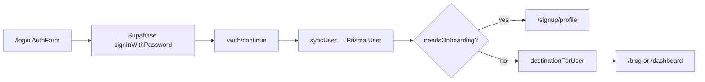
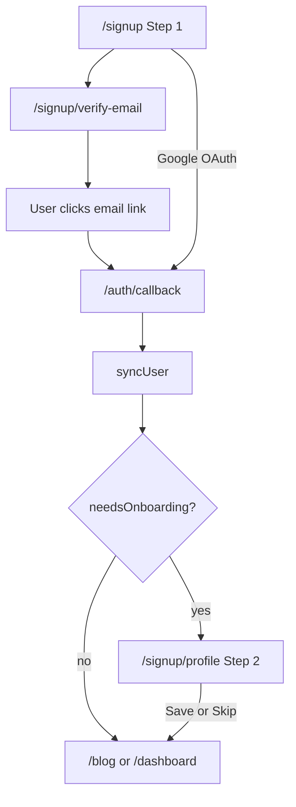

# HobbyEngineerDeck — Codebase Guide (Part 1)

Part 1 covers **project structure**, the **landing page**, and the **login / signup flows**. Later parts will cover the blog, mentor dashboard, and editor.

---

## What this app is

HobbyEngineerDeck is a Next.js web app for hobbyist engineers and makers. Today it ships:

- A **marketing landing page** at `/`
- **Public blog** at `/blog`
- **Auth** (email/password + Google via Supabase)
- A **mentor dashboard** at `/dashboard` (out of scope for this part, but listed in the tree)

**Stack (relevant here):** Next.js App Router, Supabase Auth, Prisma + Postgres for app users, Tailwind + shadcn-style UI components.

---

## How Next.js routing works here

Folders in `app/` define URLs. **Route groups** — folders wrapped in parentheses like `(site)` — organize code **without** appearing in the URL.

| Folder | Appears in URL? | Purpose |
|--------|-----------------|---------|
| `app/(site)/` | No | Public site: landing, auth pages, blog |
| `app/(site)/(marketing)/` | No | Landing page only |
| `app/(site)/(auth)/` | No | Login and signup pages |
| `app/(mentor)/dashboard/` | Yes → `/dashboard` | Mentor workspace |

So `app/(site)/(auth)/login/page.tsx` serves **`/login`**, not `/site/auth/login`.

---

## Project structure (Part 1 scope)

```
HobbyEngineerDeck/
├── app/                          # Routes, layouts, API handlers
│   ├── layout.tsx                # Root: fonts, global CSS, top loader, toasts
│   ├── globals.css               # Design tokens, Tailwind theme
│   │
│   ├── (site)/                   # Public “site” experience
│   │   ├── layout.tsx            # SiteHeader + page + SiteFooter
│   │   ├── loading.tsx           # Skeleton while site pages load
│   │   ├── (marketing)/
│   │   │   └── page.tsx          # Landing page → /
│   │   ├── (auth)/
│   │   │   ├── login/page.tsx    # → /login
│   │   │   └── signup/
│   │   │       ├── page.tsx      # → /signup (Step 1)
│   │   │       ├── verify-email/page.tsx
│   │   │       └── profile/page.tsx   # Step 2 (onboarding)
│   │   └── blog/                 # (Part 2) public blog
│   │
│   ├── (mentor)/dashboard/       # (Part 2) mentor workspace → /dashboard
│   │
│   └── auth/                     # Auth route handlers (not pages)
│       ├── callback/route.ts     # OAuth + email-confirm redirect
│       └── continue/route.ts     # Post–password-login redirect
│
├── components/
│   ├── auth/                     # Login + signup UI
│   ├── site/                     # SiteHeader, footer, sign-out, portal switcher
│   └── ui/                       # Shared primitives (Button, Input, Select, …)
│
├── lib/
│   ├── auth/                     # Session, sync, portal, onboarding logic
│   ├── supabase/                 # Supabase clients + request proxy helper
│   └── prisma/                   # Database client
│
├── prisma/
│   └── schema.prisma             # User model + blog tables
│
└── proxy.ts                      # Runs on every request: refresh auth, guard /dashboard
```

### Why these top-level folders exist

| Folder | Why |
|--------|-----|
| **`app/`** | Next.js App Router: each `page.tsx` is a route; `layout.tsx` wraps child routes. |
| **`components/`** | React UI split by domain (`auth`, `site`, `ui`) so pages stay thin. |
| **`lib/`** | Server-safe helpers and business logic (not tied to a single page). |
| **`prisma/`** | Database schema and migrations; `User` rows mirror Supabase auth users. |
| **`proxy.ts`** | Replaces classic `middleware.ts` in this Next.js version — refreshes Supabase session cookies on each request. |

---

## Layout chain (landing + auth pages)

Every public page shares the same chrome. Layouts nest from outside in:

```
app/layout.tsx                    ← html, body, fonts, Toaster, top progress bar
  └── app/(site)/layout.tsx       ← SiteHeader + {children} + SiteFooter
        └── page content          ← landing, login, signup, blog, …
```

**Files and roles:**

| File | Role |
|------|------|
| [`app/layout.tsx`](../app/layout.tsx) | Global shell. No navigation. |
| [`app/(site)/layout.tsx`](../app/(site)/layout.tsx) | Adds [`SiteHeader`](../components/site/site-header.tsx) and [`SiteFooter`](../components/site/site-footer.tsx). |
| [`components/site/site-header.tsx`](../components/site/site-header.tsx) | Sticky nav: Home, Blog, Log in / Sign up (guests) or Sign out (signed in). |

The header reads auth state on the server via [`lib/auth/session.ts`](../lib/auth/session.ts) so it can swap guest vs signed-in UI without a separate client auth provider.

---

## Landing page (`/`)

**Route file:** [`app/(site)/(marketing)/page.tsx`](../app/(site)/(marketing)/page.tsx)

This is a **single self-contained page** — hero, feature modules, FAQ, and CTAs. It does not import a separate `components/marketing/` folder; content and layout live in one file.

**What it connects to:**

| From landing | Goes to | Why |
|--------------|---------|-----|
| “Create a free account” / Sign up CTAs | `/signup` | Starts Step 1 signup |
| “Read the blog” | `/blog` | Public blog index |
| Header (via site layout) | `/login`, `/signup` | Same auth entry points |

**Data:** The landing page is static marketing copy + icons (`lucide-react`). It does not hit the database.

---

## Auth architecture (big picture)

The app uses **two identity layers**:

1. **Supabase Auth** — email/password, Google OAuth, sessions, email confirmation.
2. **Prisma `User`** — app profile, capabilities (`isMember`, `isMentor`, `isAdmin`), onboarding fields.

They are linked by **the same UUID**: Supabase `user.id` = Prisma `User.id`.

```
Browser                    Next.js                         Supabase          Postgres
   │                          │                                │                 │
   │  signIn / signUp         │                                │                 │
   ├─────────────────────────►│  lib/supabase/client.ts        │                 │
   │                          ├───────────────────────────────►│  auth.users     │
   │                          │                                │                 │
   │  /auth/callback or       │  syncUser()                    │                 │
   │  /auth/continue          ├────────────────────────────────┼────────────────►│ User
   │                          │  lib/auth/sync-user.ts         │                 │
```

**Key lib files:**

| File | Responsibility |
|------|----------------|
| [`lib/supabase/client.ts`](../lib/supabase/client.ts) | Browser Supabase client (forms call `signIn`, `signUp`, OAuth). |
| [`lib/supabase/server.ts`](../lib/supabase/server.ts) | Server Supabase client (reads session from cookies). |
| [`lib/supabase/proxy.ts`](../lib/supabase/proxy.ts) | Called from [`proxy.ts`](../proxy.ts): refresh session, block `/dashboard` if logged out. |
| [`lib/auth/sync-user.ts`](../lib/auth/sync-user.ts) | Creates/updates Prisma `User` from Supabase user + metadata. |
| [`lib/auth/session.ts`](../lib/auth/session.ts) | `getAuthUser()`, `requireAppUser()`, `getSessionContext()` for pages. |
| [`lib/auth/capabilities.ts`](../lib/auth/capabilities.ts) | `canAuthor` (= mentor or admin), `isMember`, `isAdmin`. |
| [`lib/auth/portal.ts`](../lib/auth/portal.ts) | Where to send user after login: `/blog` vs `/dashboard`. |
| [`lib/auth/onboarding.ts`](../lib/auth/onboarding.ts) | Whether Step 2 profile is still needed; redirect helpers. |

**Portal cookie (`hed_portal`):** [`lib/auth/portal-cookie.ts`](../lib/auth/portal-cookie.ts) stores whether the UI shows **Learner** or **Mentor** chrome. The proxy sets it from the URL path (`/blog` → learner, `/dashboard` → mentor). Relevant after login; mentioned here because auth routes write it.

---

## Login flow

### Pages and components

| URL | Page | Component |
|-----|------|-----------|
| `/login` | [`app/(site)/(auth)/login/page.tsx`](../app/(site)/(auth)/login/page.tsx) | [`components/auth/auth-form.tsx`](../components/auth/auth-form.tsx) |

[`AuthForm`](../components/auth/auth-form.tsx) is **login only** (signup moved to its own flow). It renders:

1. Email + password → **Sign in**
2. **Continue with Google**
3. Footer link → `/signup`

### Password login path



1. User submits the form → [`auth-form.tsx`](../components/auth/auth-form.tsx) calls `supabase.auth.signInWithPassword`.
2. On success, client navigates to **`/auth/continue?next=…`** ([`app/auth/continue/route.ts`](../app/auth/continue/route.ts)).
3. Server reads Supabase session → [`syncUser()`](../lib/auth/sync-user.ts) ensures a Prisma row exists.
4. [`resolvePostAuthDestination()`](../lib/auth/onboarding.ts):
   - If `onboardingCompletedAt` is null → **`/signup/profile`** (finish Step 2).
   - Else → [`destinationForUser()`](../lib/auth/portal.ts): mentors/admins → `/dashboard`, members → `/blog` (or safe `next` param).

### Google login path

Same form’s Google button → Supabase OAuth → Supabase redirects to **`/auth/callback`** ([`app/auth/callback/route.ts`](../app/auth/callback/route.ts)) → same `syncUser` + `resolvePostAuthDestination` logic as above.

### Request guard (proxy)

[`proxy.ts`](../proxy.ts) → [`lib/supabase/proxy.ts`](../lib/supabase/proxy.ts):

- Refreshes auth cookies on each matched request.
- If user hits **`/dashboard/*`** without a session → redirect to **`/login?next=…`**.

Login pages themselves are **not** protected; anyone can view `/login` and `/signup`.

---

## Signup flow (two steps)

Signup is split so Step 1 stays fast and Step 2 (profile) is skippable.

### Step 1 — Account basics (`/signup`)

| Piece | File |
|-------|------|
| Page | [`app/(site)/(auth)/signup/page.tsx`](../app/(site)/(auth)/signup/page.tsx) |
| Form | [`components/auth/signup-step-one-form.tsx`](../components/auth/signup-step-one-form.tsx) |
| Password UX | [`components/auth/password-field.tsx`](../components/auth/password-field.tsx), [`lib/auth/password.ts`](../lib/auth/password.ts) |
| Phone (optional) | [`components/auth/phone-field.tsx`](../components/auth/phone-field.tsx) |
| Shared chrome | [`components/auth/auth-shell.tsx`](../components/auth/auth-shell.tsx) |

**Fields:** first name, last name, email, optional phone, password + confirm (with live rules checklist).

**On submit (email/password):**

1. Client validates password rules ([`lib/auth/password.ts`](../lib/auth/password.ts)).
2. `supabase.auth.signUp` with metadata (`first_name`, `last_name`, phone) and  
   `emailRedirectTo: /auth/callback?next=/signup/profile…`
3. User is sent to **`/signup/verify-email?email=…`** — informational; **no session yet** (email confirmation required).

**Google from Step 1:** OAuth → `/auth/callback?next=/signup/profile…` → session created immediately → Step 2 if onboarding incomplete.

### Verify email (`/signup/verify-email`)

| File | [`app/(site)/(auth)/signup/verify-email/page.tsx`](../app/(site)/(auth)/signup/verify-email/page.tsx) |

Static “check your inbox” screen. After the user clicks the Supabase confirmation link, the browser hits **`/auth/callback`**, which creates the session and sends them to Step 2.

### Step 2 — Profile / onboarding (`/signup/profile`)

| Piece | File |
|-------|------|
| Page (auth guard) | [`app/(site)/(auth)/signup/profile/page.tsx`](../app/(site)/(auth)/signup/profile/page.tsx) |
| Form | [`components/auth/signup-step-two-form.tsx`](../components/auth/signup-step-two-form.tsx) |
| Server actions | [`lib/auth/onboarding-actions.ts`](../lib/auth/onboarding-actions.ts) |

**Guard:** [`requireAppUser()`](../lib/auth/session.ts) — no session → redirect to `/login`.  
If onboarding already completed → redirect home via [`destinationForUser()`](../lib/auth/portal.ts).

**Fields:** member type (required on save), field of study (if Student), experience, interest pills, location.  
**Actions:**

- **Continue** → `saveOnboardingProfile` → sets profile fields + `onboardingCompletedAt` → redirect.
- **Complete later** → `skipOnboarding` → sets `onboardingCompletedAt` only → redirect.

Profile data is stored on **Prisma `User`** ([`prisma/schema.prisma`](../prisma/schema.prisma)), not only in Supabase metadata.

### Full signup diagram (email + password)



---

## How the files “connect the dots”

### Landing → auth

```
(marketing)/page.tsx  ──Link──►  /signup  ──►  signup-step-one-form.tsx
                └──Link──►  /login   ──►  auth-form.tsx

(site)/layout.tsx  ──►  site-header.tsx  ──►  /login, /signup links
```

### Auth forms → Supabase → app user

```
auth-form.tsx / signup-step-one-form.tsx
    └── lib/supabase/client.ts  (browser)
            └── Supabase Auth session cookie

/auth/callback or /auth/continue
    └── lib/supabase/server.ts  (read cookie)
    └── lib/auth/sync-user.ts   (upsert Prisma User)
    └── lib/auth/onboarding.ts  (maybe → /signup/profile)
    └── lib/auth/portal.ts      (else → /blog or /dashboard)
    └── lib/auth/portal-cookie.ts (set hed_portal)
```

### Session used in header

```
site-header.tsx
    └── lib/auth/session.ts → getAuthUser(), getSessionContext()
    └── lib/auth/capabilities.ts → canAuthor() for mentor-only UI
    └── components/site/sign-out-button.tsx → supabase.auth.signOut()
```

---

## User model (auth-relevant fields)

From [`prisma/schema.prisma`](../prisma/schema.prisma) — what signup/login populate:

| Field | Set when |
|-------|----------|
| `id`, `email` | First `syncUser` after Supabase signup/login |
| `firstName`, `lastName`, `name` | Step 1 metadata → `syncUser`; `name` used on blog bylines |
| `phoneCountryCode`, `phoneNumber` | Step 1 metadata (optional) |
| `isMember` | Default `true` on create |
| `isMentor`, `isAdmin` | Manually in DB (README: promote writers here) |
| `memberType`, `fieldOfStudy`, … | Step 2 save (optional fields except member type on submit) |
| `onboardingCompletedAt` | Step 2 save **or** skip; null means “send to `/signup/profile`” |

Capabilities drive routing: [`canAuthor()`](../lib/auth/capabilities.ts) → home is `/dashboard` instead of `/blog`.

---

## Part 2 preview (not covered here)

- Public blog: `app/(site)/blog/`
- Mentor dashboard + editor: `app/(mentor)/dashboard/`
- Blog components: `components/blog/`
- Blog server logic: `lib/blog/`

---

## Local dev pointers

- Env: copy `.env.example` → `.env.local` (Supabase URL, keys, `DATABASE_URL`).
- Auth redirect URL in Supabase: `http://localhost:3000/auth/callback`.
- After schema changes: `npx prisma migrate dev`.

---

*Part 1 — structure, landing, login, signup. Ask for Part 2 when you want the blog and dashboard traced the same way.*
